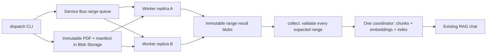

# Azure distributed PDF extraction: implemented code and staging plan

## What is implemented

`azure_pipeline.py` dispatches one PDF as page-range messages, runs a Service Bus
consumer, reconciles missing results, and collects completed documents. Extraction
replicas do not embed text or write private copies of Chroma. A single coordinator
can collect the complete document and invoke the existing RAG indexing function.



This is **distributed extraction code, not a deployed production platform**.
Polling-based automatic dispatch and finalization/indexing are now available through
one coordinator. Blob-created event handlers, a shared cloud vector backend, HA
coordination, authentication for users, and deployment infrastructure remain to build. Local `jobs.py watch` still
uses local workers; it does not silently upload user files to Azure.

## Source layout

| File | Responsibility |
| --- | --- |
| `src/pdf_pipeline/distributed.py` | Manifest/task validation, deterministic IDs, idempotency, completion barrier |
| `src/pdf_pipeline/azure_adapters.py` | Blob SDK I/O, Service Bus settlement, native extraction subprocess |
| `azure_pipeline.py` | Manual commands plus automatic coordination, status and retry commands |
| `src/pdf_pipeline/orchestrator.py` | Durable observed-upload state, bounded reconciliation and complete-only indexing |
| `requirements-azure.txt` | Extraction worker SDK dependencies, separate from embedding dependencies |
| `Dockerfile.azure-worker` | Non-root, extraction-only worker image |
| `tests/test_distributed.py` | Protocol/SDK doubles and real subprocess failure tests |

## Required resources (not created)

The automatic coordinator described below uses these same existing resources; it
does not provision them. Grant the coordinator Blob source read/result read/source
write access and Service Bus Data Sender, and workers the roles described below.

Choose and approve the subscription, region and budget before provisioning:

1. A private Blob container for source PDFs, manifests and results.
2. An Azure Service Bus namespace and queue with a finite max delivery count
   (start with 5), message expiry appropriate for the backlog, and dead-letter
   handling. Configure these in the service; the Python worker does not create them.
3. A container registry and Container Apps environment for the worker image.
4. A managed identity with access to the chosen resources.

Dispatcher identity needs Blob Data Contributor and Service Bus Data Sender.
Worker identity needs Blob read/write permissions for its source/results container
and Service Bus Data Receiver. A collector without dispatch needs Blob read access.
Scope role assignments to the required resources; don't grant subscription Owner
to run workers. A single container makes contributor permissions broader than an
ideal production split of read-only sources and writable results.

The code uses `DefaultAzureCredential`. Locally, use an authorized Azure CLI login;
on Azure, attach a managed identity. Do not put account keys or connection strings
in messages or container images. The worker does not require Azure OpenAI settings.

## Configuration

Provide these as environment variables or in a local, ignored `.env`:

```dotenv
AZURE_STORAGE_ACCOUNT_URL=https://YOUR_ACCOUNT.blob.core.windows.net
AZURE_STORAGE_CONTAINER=pdf-pipeline
AZURE_SERVICEBUS_NAMESPACE=YOUR_NAMESPACE.servicebus.windows.net
AZURE_SERVICEBUS_QUEUE=pdf-ranges
```

The storage URL is the account endpoint, not a SAS URL. The namespace is a host,
not a connection string. Never print credential values while troubleshooting.

## Staging commands

Extraction task/manifest schema is now 2. Local and Azure workers share
`ExtractionOptions` and PyMuPDF/Tesseract extraction. Set `--ocr auto`,
`--ocr-language`, and `--ocr-dpi` on `dispatch` or `coordinate`; worker tasks carry
those settings in the versioned manifest. Default `--ocr off` rejects unresolved
scan-like pages rather than publishing missing text. See the
[shared OCR policy](CODE_WALKTHROUGH.md#extraction-quality-and-ocr).

Upgrade dispatchers and workers together and preserve/replay outstanding schema-1
work through a controlled new queue. Do not change policy on an existing bound
coordinator state and expect old ready receipts to reflect it: stop the old process
and use a new state namespace for deliberate re-ingestion. No resources are reset
or deleted for you. English OCR data is included by the updated image definitions;
other language packs must be installed on the worker image. Images remain unbuilt
and native OCR accuracy/performance remains unverified.

Install worker dependencies into the project environment when downloads work:

```powershell
.\.venv\Scripts\python.exe -m pip install -r requirements-azure.txt
```

Dispatch is an explicit upload of the named PDF to your configured Azure account:

```powershell
.\.venv\Scripts\python.exe azure_pipeline.py dispatch data/input/report.pdf --document-id report --pages-per-task 10
```

Save the returned `version` hash. A 60-page PDF produces six range messages; five
such documents produce 30 messages. Document IDs must be distinct for different
documents and stable when updating that document. Messages contain only the
schema, manifest version, start page and exclusive end page. Blob names are
derived by the application, not accepted as arbitrary URLs in task messages.

Run a worker locally for SDK verification, or on multiple Azure replicas:

```powershell
.\.venv\Scripts\python.exe azure_pipeline.py worker
```

`worker --once` receives at most one message (waits up to 10 seconds), processes
it and exits. The default worker keeps receiving until stopped. Each replica runs
one range at a time in an isolated process; don't multiply it by an unrestricted
local process pool. Start with two replicas and measure before increasing to four.

Build the image only after Docker Desktop's Linux engine is running:

```powershell
docker build -f Dockerfile.azure-worker -t rag-range-worker:dev .
```

Configure the image, environment variables, managed identity and Service Bus
scaling rule on Container Apps after approving deployment. Use no ingress for
extraction workers. This repository does not yet provision that scaling rule.
No image was built or deployed during implementation: Docker's Linux engine was
unavailable locally. SDK/native dependencies are also missing in the local venv.

When all ranges are stored, collect on ONE coordinator:

```powershell
.\.venv\Scripts\python.exe azure_pipeline.py collect VERSION_HASH
# Requires full requirements.txt and an installed embedding model runtime:
.\.venv\Scripts\python.exe azure_pipeline.py collect VERSION_HASH --index
```

Without `--index`, collection validates all ranges and reports counts. To save
an extra page-record copy under `data/output/azure/`, explicitly add `--export`.
With `--index`, records go directly through the existing chunker/embedding model to the coordinator's
Chroma database. Chat must access that same database; do not run this flag on
every extraction replica. Sources are cited as `<document-id>.pdf`, with original
page numbers and version metadata. Blank pages are omitted without renumbering.

No Azure Blob cleanup is performed after indexing. Deleting range results without
an authoritative indexed-version record would make reconciliation resend old
work; deleting source PDFs could break retries. Add durable publication receipts
and coordinated retention before automating cloud deletion. This is a remaining
distributed-flow requirement, not something the local cleanup implements.

## Retries, reconciliation and monitoring

- Source PDF bytes are hashed and published before the immutable manifest. If
  dispatch fails while sending messages, rerun dispatch with the same PDF/config,
  or use `azure_pipeline.py reconcile VERSION_HASH`. It resends ranges with no
  valid stored result; it may also duplicate still-running tasks safely.
- Queue messages have deterministic IDs. Correctness does not depend on broker
  deduplication. If broker duplicate detection is enabled, its suppression window
  can delay a manual resend; account for it when reconciling or replaying dead letters.
- Workers use PeekLock with prefetch disabled and auto lock renewal. Result blobs
  are validated before message completion. Lost ACKs trigger harmless redelivery:
  an existing valid result is acknowledged without another extraction.
- Malformed tasks, hash mismatches and corrupt stored results are dead-lettered.
  Native/transient failures are abandoned for retry. Retries use Service Bus
  delivery limits; there is no additional scheduled exponential backoff here.
- The first valid create-only range result wins. Completion is derived from the
  manifest's exact expected ranges, not a counter that duplicates can inflate.
- `collect` refuses partial, corrupt or all-empty documents. It has no timeout loop;
  rerun after workers finish. It does not automatically activate the latest version.
- Worker JSON events include settlement outcome, elapsed time and error class.
  Monitor Service Bus active/dead-letter counts, oldest message age, replica CPU,
  memory, restart counts, and stored range coverage before scaling up.

## Limits and release gates

- Current native extraction timeout defaults to 300 seconds, configurable to at
  most 900. It bounds the subprocess, not total download/upload/settlement time.
  Lock renewal has a finite window of extraction timeout plus 180 seconds.
- Input PDF limit is 100 MiB; output limit is 16 MiB per range. PDF downloads are
  bounded but held in memory and downloaded once per task, not cached per replica.
  Long documents can therefore cause repeated downloads; benchmark egress, CPU,
  disk and memory before choosing range size. Real extraction speed is unmeasured.
- Files, manifests and results persist in Blob Storage. Set retention/backup and
  access policies. Result checksums detect corruption, not malicious authorized
  writers. The container/queue are trusted internal infrastructure, not public APIs.
- The extraction schema version must be bumped when result semantics change;
  freeze and test worker dependency versions before a release. Version ranges in
  requirements are not a reproducible production lockfile.
- The local coordinator now stages immutable revisions and atomically publishes
  SQLite pointers for application readers. It does not enforce chronological Azure
  version ordering: do not collect an old document version over a newer one. Old
  vectors are retained for pinned readers. This single-host publication mechanism
  is not a shared cloud vector service; implement distributed ownership, version
  ordering and retirement before providing multi-replica public chat.
- `worker --once` returning zero can mean no message, completed delivery, abandon,
  or dead-letter settlement. Inspect the event outcome; process exit alone is not
  proof the document succeeded. Automatic finalization is available in coordinate
  mode; cloud alerts and HA remain to build.
- Adapter tests use SDK doubles. Live Blob permissions, Service Bus lock renewal,
  actual SDK compatibility, image startup, scaling, and Azure network behavior
  are unverified until a staging run. No end-to-end cloud success is claimed.

## Acceptance test before deployment approval

1. Build the image and run two workers against a dedicated staging queue/container.
2. Upload five known 60-page PDFs; verify 30 range tasks and 300 ordered page results.
3. Stop a worker during a task; confirm redelivery and no duplicated page records.
4. Resend a completed task; confirm no extraction and a successful acknowledgment.
5. Remove one staging range result; confirm collection refuses the incomplete version.
6. Reconcile missing work, collect, index centrally, and verify known-answer citations.
7. Measure total processing time, memory, queue age and cost with two versus four
  replicas. Only then select resource/replica limits for automatic operation.

## Automatic coordinator

Run **one** coordinator per watched cloud configuration/index. Extraction workers
can run on different machines and share the Service Bus queue; the coordinator
still owns a single local Chroma index and SQLite state, not an HA cloud database.

```powershell
.\.venv\Scripts\python.exe azure_pipeline.py coordinate --incoming-prefix incoming/ --pages-per-task 10
```

Provide the existing `AZURE_STORAGE_ACCOUNT_URL`, `AZURE_STORAGE_CONTAINER`,
`AZURE_SERVICEBUS_NAMESPACE`, and `AZURE_SERVICEBUS_QUEUE` settings. The coordinator
requires both requirements files, a Blob/Service Bus identity, and a downloadable
MiniLM model on first use. It does not call the Azure answer service. The same
coordinator index can be queried by the existing chat process on its host.

Upload final PDFs under `incoming/` in the Blob container. Use a non-PDF temporary
name while uploading and make the completed blob available with a `.pdf` suffix;
Azure block-blob commits expose completed block lists. The coordinator sees committed
blobs, not uncommitted upload blocks. Do not append to or rewrite visible PDFs while
expecting an atomic upload-completion signal.

Flow:

1. Read one bounded page of blob names/ETags per cycle; persist the continuation token.
2. Create or update a durable observed-version row per blob name. Unchanged ETags,
  including ready/failed rows, do not restart jobs.
3. Check the current ETag and download conditionally. A changed upload is not
  silently dispatched under an earlier observation.
4. Save the manifest version and dispatch immutable page-range tasks. Repeating
  after a partial send is idempotent at the range-result boundary.
5. Periodically inspect expected results; resend missing ranges while within the
  document deadline. In-flight tasks may be resent, so worker idempotency matters.
6. Require complete valid page coverage, check the upload ETag again, preserve
  the original blob name in citations, then chunk/embed/publish via the local
  atomic index path. One loaded embedding model is reused across documents.
7. Save `ready` and its chunk count. Restarting preserves the receipt and does not
  repeat completed indexing for the same observed ETag.

The source identity in the coordinator index is `azure-upload:<blob-name>`, not
the synthetic source label used by manual `collect --index`. Do not mix manual and
automatic indexing of the same documents or share the index across accounts/stores;
those are different source identities/ownership boundaries.

Defaults: list up to 100 blobs per cycle, act on up to 10 due documents, pause 10
seconds between cycles, revisit incomplete results every 60 seconds, allow five
operational failures with bounded backoff, and fail a document after 3600 seconds
from its observation. Waiting for results does not consume the failure count, but
the deadline prevents indefinite re-enqueueing of poison/dead-letter tasks. A long
coordinator indexing operation delays other checks; this is not a parallel finalizer.

State is in `data/azure-coordinator/jobs.sqlite3` by default (ignored by Git).
It binds to the account/container/queue/prefix/range size and target index; it
rejects configuration changes against the same state. Keep it and the index on
durable local disk. Back them up together during stopped-writer maintenance.
Status includes IDs/state/version/attempts/errors, not credentials or PDF contents.

```powershell
.\.venv\Scripts\python.exe azure_pipeline.py coordinate-status
# Stop the coordinator before explicitly retrying a failed document:
.\.venv\Scripts\python.exe azure_pipeline.py coordinate-retry DOCUMENT_ID
```

`coordinate --once` performs one scan/work cycle; it does not wait for workers.
Exit zero can mean documents are still pending/extracting. Inspect the progress
counts and durable state, not just exit status. `failed` rows are not retried forever;
correct the cause and use the explicit retry command or upload a corrected version.

Observed overwrites supersede unfinished rows. Completed old worker results cannot
finalize a newer observed job. However, an upload can change after the final ETag
check while indexing is underway: the just-completed observed version can become
visible until the next scan finds and processes the new one. This is not a transaction
between Blob and Chroma, and not a guarantee to always answer from the latest wall-
clock upload. Deleting a blob does not delete prior indexed content. Intermediate
overwrites that occur entirely between scans are not guaranteed to be processed.

Index publication now commits a generation-linked receipt in its own SQLite
transaction. If the coordinator dies before storing that receipt locally, replay
with the same generation/input returns the original receipt without another vector
write or republishing an older source revision. Range results are still needed to
reconstruct and verify the input on replay. The coordinator verifies receipt
identity against the publication store before saving ready.

Overwrites and explicit retries create fresh processing generations; append-only
transition history preserves the prior generation. Old coordinator rows migrate
with no fabricated receipt. Use `coordinate-status --history --retirement-preview`
to inspect bounded local evidence. Cloud worker messages still reference the
content manifest, not this new coordinator generation: retirement fencing is not
implemented. No distributed exactly-once transaction or cloud Blob deletion is
claimed. Manifests/results and source snapshots remain in Azure; completed local
receipts alone are not a cloud garbage-collection policy.

Build the optional coordinator image when Docker is available:

```powershell
docker build -f Dockerfile.azure-coordinator -t rag-coordinator:dev .
```

It runs non-root and expects writable persistent `/data` for state and Chroma.
It requires the full embedding stack, unlike the extraction-worker image. A
container's writable layer is not durable storage across replacements. Do not
scale coordinator replicas or place SQLite/Chroma on an arbitrary network share;
choose a tested persistent local-volume host, or implement shared storage and
distributed fencing first. The image and Azure SDK calls are not live-verified.

No Event Grid endpoint or automatic deployment is created. Polling provides automatic
discovery/reconciliation while the coordinator runs. Native PDF page-count inspection,
model initialization and vector indexing still need stronger whole-operation
deadlines. Test SDK permissions, paging, conditional downloads, real PDFs, retries,
and load in staging before production use.