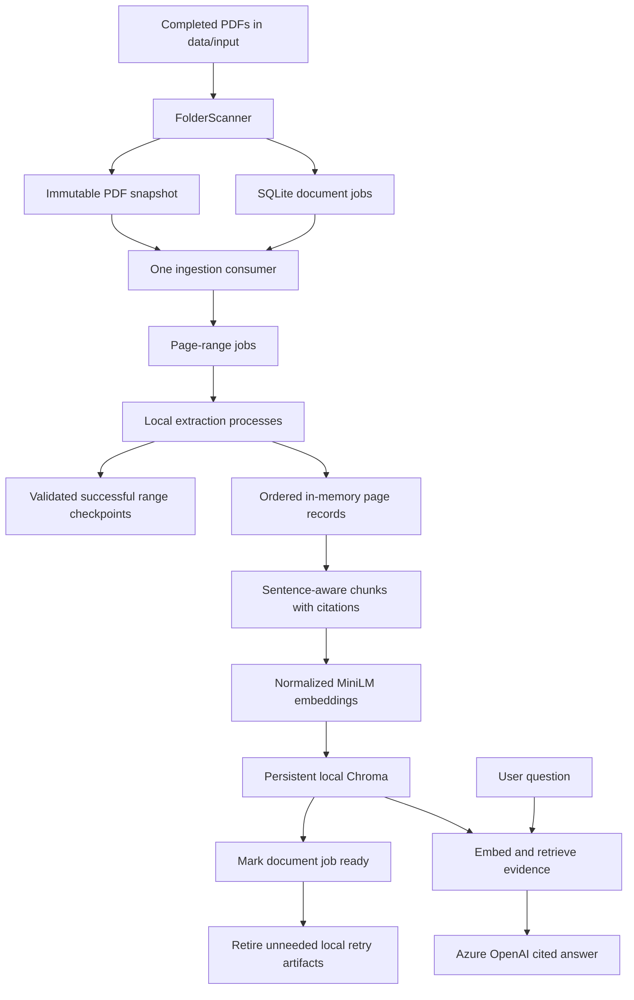
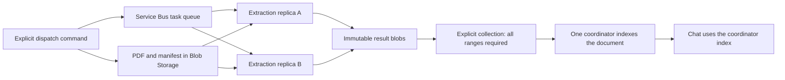
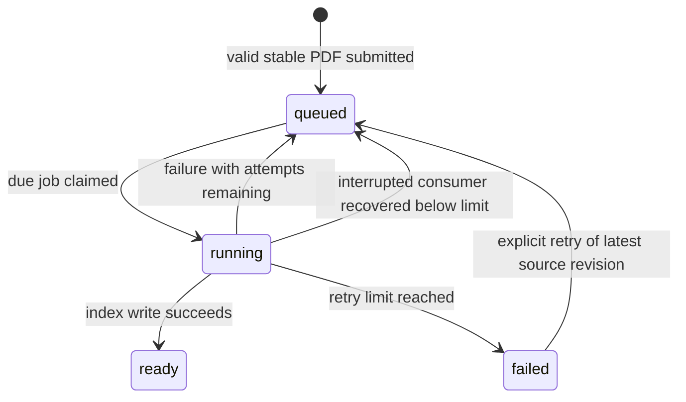

# Complete RAG System Guide

This is the main detailed guide for this repository. Start here to understand the
architecture, follow the code, run the application, monitor it, and see what is
still missing. [README.md](../README.md) is the short starting page.

Documentation describes the implementation inspected on 2026-09-15. It does not
claim that missing dependencies have been installed or that Azure has been deployed.

## Contents

- [Purpose and current status](#purpose-and-current-status)
- [Architecture](#architecture)
- [Code ownership and reading order](#code-ownership-and-reading-order)
- [Local processing step by step](#local-processing-step-by-step)
- [Job states and recovery](#job-states-and-recovery)
- [Automatic folder operation](#automatic-folder-operation)
- [Data formats](#data-formats)
- [Storage and cleanup](#storage-and-cleanup)
- [Setup and configuration](#setup-and-configuration)
- [Azure multi-machine processing](#azure-multi-machine-processing)
- [Monitoring and troubleshooting](#monitoring-and-troubleshooting)
- [Accuracy and evaluation](#accuracy-and-evaluation)
- [Production roadmap](#production-roadmap)

## Purpose and current status

Two workflows share one searchable index:

1. **Ingestion:** save a PDF, extract its pages, split text, create embeddings, store chunks.
2. **Question answering:** embed a question, retrieve useful chunks, ask Azure for a cited answer.

**Local mode:** PyMuPDF extraction, MiniLM embeddings, and Chroma run on this
machine. Only the question and retrieved text go to Azure OpenAI for an answer.
The folder watcher does not upload the PDF or start a conversation by itself.

**Optional Azure extraction mode:** an explicit dispatch command uploads the PDF
to Blob Storage. Service Bus workers can extract ranges on separate machines.
Collection and indexing are still explicit coordinator actions; this is not yet
a fully automatic cloud ingestion service. Do not confuse these two modes.

RAG means retrieval-augmented generation. It supplies relevant evidence to a
model at question time; it does not train that model on every uploaded PDF.

| Capability | Actual status |
| --- | --- |
| Local stable-file discovery, durable jobs, range extraction, retries and checkpoints | Implemented, with local contract and process tests |
| In-memory extraction handoff, batched embeddings and Chroma indexing | Connected in code; native end-to-end execution remains unverified |
| Retrieval and Azure answer generation | Connected; an earlier small Azure-only request passed, not a full PDF flow |
| Azure dispatch, range workers, reconciliation and collection | Implemented code; live SDK/cloud behavior and worker image are unverified |
| Automatic cloud upload-event dispatch and finalization/indexing | Not implemented |
| Multi-user authentication, conversation memory, streaming and atomic index versions | Not implemented |

The last environment audit found zero input PDFs, no populated Chroma index,
and missing PyMuPDF, Chroma, SentenceTransformers and Azure SDK dependencies.
The worker image build could not connect to Docker Desktop's Linux engine.
These are recorded observations, not a fresh check performed for this guide.
No end-to-end production-readiness claim is justified yet.

The `#` comments inside the Python files explain the important decisions. The
older [MVP notes](MVP.md) and [Azure notes](AZURE_WORKERS.md) remain as specialist
references; you do not need to read them to follow this consolidated guide.

## Architecture

### Local automatic path



There are two different types of queue: SQLite records durable **document jobs**;
the multiprocessing queue distributes temporary **page-range assignments**.
The first survives a process restart. The second is reconstructed from document
state and saved range checkpoints.

### Optional Azure path



The local watcher is not connected to the Azure dispatcher. The Azure extraction
replicas must not each write a separate local Chroma database and expect one shared
search experience. Shared vector storage and automatic finalization are later work.

## Code ownership and reading order

| Step | File and function | Question to answer while reading |
| --- | --- | --- |
| 1 | [jobs.py](../jobs.py): `main` | Which command did the operator request? |
| 2 | [job_store.py](../src/pdf_pipeline/job_store.py): `enqueue` | Which exact PDF bytes will this job process? |
| 3 | [jobs.py](../jobs.py): `watch`, `consume`, `process_due` | Can this consumer own the queue and claim a due document? |
| 4 | [jobs.py](../jobs.py): `make_processor` | How does the stored PDF become searchable chunks? |
| 5 | [ingest_sources.py](../ingest_sources.py): `load_pdf` | How is the original source preserved through extraction? |
| 6 | [main.py](../src/pdf_pipeline/main.py): `run_pipeline` | How are page jobs distributed and results checked? |
| 7 | [scheduler.py](../src/pdf_pipeline/scheduler.py), [worker.py](../src/pdf_pipeline/worker.py), [extractor.py](../src/pdf_pipeline/extractor.py) | Who creates tasks, runs them, and reads the PDF? |
| 8 | [collector.py](../src/pdf_pipeline/collector.py): `collect_results` | How are pages sorted and saved? |
| 9 | [ingest_sources.py](../ingest_sources.py): `chunk_records`, `build_index` | How do text, vectors, and citations stay aligned? |
| 10 | [chat_rag.py](../chat_rag.py), [rag_core.py](../rag_core.py) | How is evidence selected and passed to the answer model? |

Additional ownership boundaries:

| File | Owns |
| --- | --- |
| [watcher.py](../src/pdf_pipeline/watcher.py) | Recursive discovery, quiet-period detection and changed-file submission |
| [models.py](../src/pdf_pipeline/models.py) | Page/range job and result data types |
| [checkpoints.py](../src/pdf_pipeline/checkpoints.py) | Result validation, content identities and atomic checkpoint files |
| [distributed.py](../src/pdf_pipeline/distributed.py) | Azure-independent manifest protocol, version isolation and completion barrier |
| [azure_adapters.py](../src/pdf_pipeline/azure_adapters.py) | Blob I/O, message settlement and timeout-isolated native extraction |
| [azure_pipeline.py](../azure_pipeline.py) | Explicit cloud dispatch, worker, reconcile and collect commands |
| [requirements.txt](../requirements.txt) | Full local application dependencies |
| [requirements-azure.txt](../requirements-azure.txt) | Extraction worker dependencies, without the embedding stack |
| [Dockerfile.azure-worker](../Dockerfile.azure-worker) | Non-root extraction worker image |
| [tests/test_jobs.py](../tests/test_jobs.py) | Queue, watcher, restart and cleanup checks |
| [tests/test_pipeline.py](../tests/test_pipeline.py) | Extraction, ranges, checkpoints and adapter checks |
| [tests/test_rag.py](../tests/test_rag.py) | Chunking, indexing, retrieval and answer contracts |
| [tests/test_distributed.py](../tests/test_distributed.py) | Manifest, settlement, version and subprocess contracts |

## Local processing step by step

The following explanation traces a 60-page text-based PDF. This is a workload
calculation and code explanation, not a generated demo or a measured performance result.

### 1. Submit a document

The watcher calls `JobStore.enqueue()`, or you call the manual enqueue command.
It copies the bytes to a content-addressed snapshot and inserts
one SQLite row. That row is a **document job**. Its state is `queued`; it is not
searchable merely because submission succeeded.

`sha256` identifies the content. The source path identifies which document this
content belongs to. Those are different concepts: two source files can contain
the same bytes while needing different citation identities.

`BEGIN IMMEDIATE` reserves the SQLite writer before the duplicate check and insert.
Without the transaction, two submissions could both see no existing job and insert
duplicates. A transaction is a consistency tool, not a distributed queue service.

### 2. Claim work

`consumer_lock()` allows one consumer for this local state directory. `claim()`
changes one eligible document from `queued` to `running` and increments attempts.
The claim commits before processing starts, so a restart can discover unfinished work.

`with store.consumer_lock():` means hold the lock throughout the indented block.
`finally` releases resources even when the block raises an exception. The operating
system also releases the lock when the owner process is killed.

### 3. Create and run page tasks

Durable jobs now create six `PageRangeJob` objects for a 60-page PDF at the default
10 pages per task. With `--workers 2`, two processes take ranges from the queue.
The end page is exclusive: start 0, end 10 means original pages 1 through 10.

The first assignment has `start_page=0` and `end_page=10`; the next has
`start_page=10` and `end_page=20`. A final range shorter than 10 pages is valid.
These are references into the original PDF, not physical split PDF files.

Each range result contains per-page `PageResult` objects; `page_index=2` still
means the third PDF page. The original single-page `PageJob` API remains available.
`rag-document` is an internal extraction identifier. Ingestion returns page
records in memory; the RAG metadata retains the original source path.

`job_queue.get()` takes one range assignment. `None` is a shutdown sentinel.
Each worker opens the PDF once, extracts the assigned pages, and returns a
`PageRangeResult`. The parent checks the task ID, page count, page order and page
identities before saving a successful range checkpoint. Range results can arrive
out of order. Duplicate range messages cannot stand in for unfinished tasks.

### 4. Restore page order and retain citations

The collector sorts by `page_index`. Normal ingestion passes page records directly
to chunking without writing exports. Explicit export mode writes one object per
JSONL line; either representation keeps the page identity, text, success and error
information. `page_index=2` becomes citation `page=3`. The adapter preserves the
original source path/title, even though extraction reads a hashed snapshot filename.

Blank pages are omitted without renumbering later pages. Extraction success is
different from finding text: scanned pages need OCR, which is not implemented.

### 5. Chunk and embed

`split_into_chunks()` keeps each text chunk within 900 characters by default.
Overlap is measured in sentences and retained only when it fits. Character limits
are not token limits; the embedding model may still truncate unusual input.

`{**record["metadata"], "chunk": chunk_number}` copies existing citation metadata
and adds the chunk's index within that page. It does not erase the page number.

`model.encode(...)` converts chunk text into numerical vectors. MiniLM is the
embedding model; it does not write the final answer. `normalize_embeddings=True`
uses normalized vectors consistently for documents and questions.

`nonlocal model` in `make_processor()` refers to the enclosing function's variable.
That closure keeps the model loaded across document jobs in one consumer invocation.
Running a new consumer process loads it again.

The model is `all-MiniLM-L6-v2`. It produces 384-dimensional embeddings. Documents
and questions must use the same model and normalization. Changing model settings
requires re-embedding the collection, not merely changing the chat configuration.

### 6. Store the index

Each upsert has four aligned lists: IDs, text, vectors, and metadata. Position 0 in
all four lists must describe the same chunk. Batching limits each encoding/upsert
call, but this implementation still keeps one document's records/chunks in memory.

`upsert` means insert a new ID or update that existing ID. Stable IDs make retries
converge without accumulating copies of unchanged chunks. Edited chunks have new
IDs; obsolete IDs are deleted after successful upserts.

This is not an atomic version switch. A failure midway through indexing can leave
old and new chunks together. Marking the document job `ready` records successful
completion; it does not prevent readers from seeing earlier partial writes.

### 7. Answer a question

`retrieve()` embeds the question with the same model used for documents. It combines
vector search with a keyword-filtered pass, removes duplicate text, applies a
distance threshold, and keeps at most `RAG_TOP_K` results.

For normalized vectors and the configured squared-L2 distance, lower distance
means closer vectors. It does not mean a measured probability that a fact is true.

`build_context()` attaches source/page labels to retrieved text. `generate_answer()`
sends that evidence and the question to Azure. With no evidence, it returns the
not-found response without a paid request. Instructions ask for grounding, but
answer correctness and citations must still be evaluated.

Current chat questions are independent. The CLI does not preserve conversation
context, stream tokens, or enforce per-user document permissions. It refreshes
the collection count for each question, but that is not an atomic index-read
guarantee. Pause ingestion for correctness-sensitive conversations until versioned
publication is implemented.

## Job states and recovery



| State | Meaning | Operator action |
| --- | --- | --- |
| `queued` | Waiting for a consumer or its retry due time | Keep the watcher running; check backlog and prerequisites |
| `running` | An attempt was durably claimed | Monitor progress; after an interruption the next consumer recovers it |
| `ready` | Indexing returned success and state was committed | Query the index; cleanup may still report a separate warning |
| `failed` | Attempt budget exhausted | Fix the cause; explicitly retry the latest version |

`ready` is not proof of answer quality, atomic publication, or successful completion
of other documents. Recovery sends an interrupted job to `failed` when its attempt
budget is already exhausted, rather than resetting the budget silently.

- Document jobs survive restarts in SQLite. Completed ranges survive as checkpoint
   JSON files. The coordinator recreates the range assignments on retry, validates
   existing checkpoints, and submits only unfinished ranges to worker processes.
- The next consumer recovers interrupted jobs while holding the consumer lock.
- Failed attempts get a due time. `watch` checks due jobs on later scan cycles;
   one-shot `work` exits and must be invoked again for a delayed retry.
- The last allowed failure becomes `failed`; retry is an explicit operator action.
- After indexing is marked ready, generated retry files are retired if no unfinished
   job shares the same PDF content. The original PDF and searchable index remain.
- A crash after index writes but before `ready` causes replay. This is why stable
  IDs matter. It is called **at-least-once processing**, not exactly-once processing.

For five 60-page PDFs, there are five durable document jobs and 30 range tasks
at 10 pages each. The current consumer processes documents sequentially and ranges
within one document in parallel. Thousands of queued files do not mean thousands
of worker processes or simultaneous embedding-model copies.

Increasing concurrency has limits. Actual local processes are capped at the number
of pending ranges. Cached ranges need no new extraction process. One document's
records and chunks still occupy memory; range tasks are not a fully streaming
large-document implementation. More workers can increase memory and I/O pressure.

## Automatic folder operation

`jobs.py watch data/input --workers 2` combines discovery and consumption in one
long-running command. `FolderScanner.scan()` observes file size and timestamps;
after the quiet period it calls the same `JobStore.enqueue()` you already learned.
`process_due()` then claims and processes due jobs while the watcher holds the
consumer lock. `Event.wait()` pauses between cycles without a busy loop.

The next cycle checks new arrivals and delayed retries. No per-file enqueue/work
commands are needed. The default scans between documents, not during native
extraction. `.partial` -> `.pdf` rename is the recommended copy-completion signal.
The watcher stays active only while its process runs; it is not an installed
Windows service. Queue state survives restart, but the per-file observation cache
is rebuilt and checked against the durable queue on startup.

| Setting | Current default | Meaning |
| --- | --- | --- |
| `watch --workers` | 2 | Local extraction processes, not Azure machines |
| `work --workers` | 4 | Processes for a manual one-shot consumer |
| `--pages-per-task` | 10 | Pages opened together per task |
| `--poll-seconds` | 2 | Wait between watch cycles; processing time also delays the next scan |
| `--stable-seconds` | 10 | Observed quiet period before submission |
| `watch --limit` | 1 | Documents processed between directory scans |
| `work --limit` | 100 | Maximum due documents processed in one invocation |
| `--max-mb` | 100 | MiB per local submitted PDF |
| `--max-attempts` | 3 | Automatic attempts for a document job |

A quiet period is a heuristic: a copy paused for longer than 10 seconds may look
finished. Use a `.partial` extension until the writer closes the file, then rename
to `.pdf`. Metadata-preserving changes are not guaranteed to be detected during
the same watcher run. File symlinks are skipped, and state/index directories must
remain outside the watched folder.

Duplicate detection compares the newest version of a source. Submitting unchanged
content returns the existing job; it does not force a fresh attempt. A changed
hash creates a new job. Pending versions of one source run in order, even during
retry backoff, while unrelated sources can continue. Removing an input file does
not delete the old indexed content.

The OS lock protects one job store, not every possible writer. Use exactly one
store per local index. Do not run a legacy ingester, another store, or an explicit
reset against the same index while the watcher is writing.

## Data formats

| Object | Fields that connect the stages | Why they matter |
| --- | --- | --- |
| Durable document job | `id`, `source`, `content_hash`, `snapshot`, `state`, `attempts`, timestamps | Identifies a source version and survives restarts |
| `PageRangeJob` | `job_id`, `document_id`, `pdf_path`, `start_page`, `end_page` | Serializable assignment with an exclusive end bound |
| `PageResult` | `job_id`, `document_id`, `page_index`, `text`, `success`, `error` | One original page, including extraction failures |
| `PageRangeResult` | range `job_id`, `document_id`, `pages` | Allows exact coverage checks before checkpointing |
| Collector page record | page fields plus `page_number` | Separates zero-based code indexes from one-based citations |
| RAG record | `text`, `metadata.source`, `title`, `type`, `page` | Preserves provenance while the temporary input path changes |
| Chunk | record metadata plus `chunk` | Identifies a segment within a page |
| Vector record | ID, text, embedding, metadata | Keeps evidence and search vectors aligned |
| Retrieved evidence | `(text, metadata, distance)` | Carries citations and relevance ordering to answer generation |

An embedding is not the original text and cannot be used as a replacement for it.
The model needs retrieved words to answer; therefore the index stores chunk text
and citations alongside vectors. Avoidable export copies are removed, not the
evidence required for RAG to work.

## Storage and cleanup

| Data | Where it lives | Lifetime |
| --- | --- | --- |
| Original PDFs | `data/input/` or the supplied input path | User-owned; never deleted by successful-job cleanup |
| Job metadata | `data/jobs/jobs.sqlite3` | Retained for deduplication, state and retry history |
| Immutable snapshots | `data/jobs/snapshots/<content-hash>.pdf` | Kept for unfinished/failed jobs; eligible for cleanup after ready |
| New range checkpoints | `data/jobs/checkpoints/by-pdf/` | Successful ranges reused during retries, retired when no unfinished job needs the content |
| Legacy flat checkpoints | Older checkpoint directories | Readable, but not automatically retired by the new grouped cleanup |
| Page records and chunks | Process memory during normal ingestion | No combined text or JSONL export is required |
| Text, embeddings and citations | `chroma_data/` by default | Persistent searchable evidence |
| Embedding model files | The model library's configured cache | Reused across invocations; may reside outside this repository |
| Azure PDFs/manifests/results | Configured private Blob container | Persist; coordinated cloud retention is not implemented |
| Optional Azure export | `data/output/azure/` | Created only with `collect --export` |

Cleanup happens after SQLite commits `ready`, not before indexing. It checks that
no queued, running, or failed job references the same content hash. This prevents
one successful document from deleting recovery data needed by another. Only
generated retry data inside the job store is eligible; originals and Chroma are
not part of that cleanup.

Filesystem or database cleanup failures produce `cleanup_deferred`; the job remains
ready and is not sent back for costly processing. Cleanup failure is not retried
on a schedule yet. Queue history, failed-job artifacts, legacy checkpoint files,
model caches and explicit exports still need operator retention policies.

Never delete Azure results just because one task succeeded. Reconciliation would
interpret a missing range as unfinished work. A cloud retention design first needs
durable indexing receipts, version ownership, retry rules and source retention.
No blanket delete command is provided because it could break recovery.

Deleting snapshots after success is not a backup strategy. Preserve original PDFs.
For backup/restore, stop writers and capture a consistent set of original sources,
job state and vector index; do not restore an old queue against an unrelated index.

## Setup and configuration

### 1. Install the environment

From the repository root, use Python 3.11. Skip venv creation if it already exists:

```powershell
py -3.11 -m venv .venv
.\.venv\Scripts\python.exe -m pip install -r requirements.txt
.\.venv\Scripts\python.exe -m pip check
```

The application must use this exact environment, not a different global Python.
Installation has previously failed on TLS connections to `files.pythonhosted.org`.
Do not disable certificate verification. Diagnose the host/network policy or use
compatible trusted offline wheels. `pip check` only verifies installed dependency
consistency; it does not prove that all application dependencies are present.

### 2. Configure answers locally

Use [.env.example](../.env.example) for the setting names. Populate your ignored
local `.env` yourself; do not paste secrets into logs or commit them.

| Setting | Purpose |
| --- | --- |
| `AZURE_OPENAI_ENDPOINT` | Endpoint for the Azure answer service |
| `AZURE_OPENAI_API_KEY` | Secret authorizing answer requests |
| `AZURE_OPENAI_DEPLOYMENT` | Deployment name, not necessarily the model's product name |
| `AZURE_OPENAI_API_VERSION` | API version for the Azure client path |
| `RAG_TOP_K` | Maximum returned evidence chunks; default 8 |
| `RAG_MAX_DISTANCE` | Maximum accepted squared-L2 distance; default 1.6 |

An endpoint ending in `/openai/v1` selects the compatible OpenAI client path.
Other endpoints use `AzureOpenAI` and the configured API version. The code sets
an SDK timeout and a bounded retry count; this is not a measured end-to-end latency
guarantee. The local folder watcher does not call the answer service on uploads.

### 3. Start the watcher once

```powershell
.\.venv\Scripts\python.exe jobs.py watch data/input --workers 2 --pages-per-task 10
```

Use your own completed PDFs. Leave the process running. It scans subfolders,
submits stable files and processes due retries without per-file commands.
Ctrl+C stops it. Closing the terminal, restarting, or sleeping the computer stops
or pauses processing. Automatic Windows logon startup is not installed.

### 4. Inspect jobs and ask questions

In a second terminal, status can be checked without stopping the watcher:

```powershell
.\.venv\Scripts\python.exe jobs.py status --limit 50
```

After indexing succeeds, ask questions with:

```powershell
.\.venv\Scripts\python.exe chat_rag.py
```

Chat requires a populated index with matching embedding metadata. For now, pause
ingestion during conversations that require a consistent document version. There
is no UI, HTTP chat service, token streaming, or persistent conversation history.

### 5. Manual controls when needed

```powershell
.\.venv\Scripts\python.exe jobs.py enqueue data/input
.\.venv\Scripts\python.exe jobs.py work --workers 2 --pages-per-task 10
.\.venv\Scripts\python.exe jobs.py retry JOB_ID
```

Replace `JOB_ID` with the actual failed latest-version ID from status. Do not run
manual work while watch holds the consumer lock. One-shot work exits when no due
job remains; delayed retries can still be queued. A zero exit is not proof that
the entire backlog is ready. The global `--state-dir` option goes before the
subcommand. Use a separate index too when testing a separate state directory.

The legacy [ingest_sources.py](../ingest_sources.py) command also accepts local
PDFs, URLs and a URL list. It does not use the durable watcher queue. URLs in
[urls.txt](../urls.txt) may be fetched when using that legacy CLI; review them
first. It has no public-upload SSRF or download-size protection. Use trusted URLs.

`--reset` on the legacy ingestion command deletes the target Chroma collection.
It is not a harmless repair option. Stop other writers, preserve originals and
plan how all sources and job state will be rebuilt before using it. Existing ready
jobs do not automatically become queued when someone deletes the index.

## Azure multi-machine processing

### Responsibilities

Azure extraction uses the same page-range concepts but different durable services:

| Component | Role |
| --- | --- |
| Blob Storage | Original immutable PDF, manifest and completed range results |
| Service Bus | At-least-once task delivery and dead-letter handling |
| Worker replicas | Read a PDF, extract one assigned range, store the result |
| Collector | Verify every manifest range before returning records |
| One indexing coordinator | Chunk/embed complete records and update the current index |
| Azure OpenAI | Generate answers from retrieved evidence, not manage extraction jobs |

For five 60-page documents and 10-page ranges, 30 messages can be distributed
across workers. Each replica processes one range at a time. Current workers
download the PDF for each task; there is no per-replica PDF cache. More replicas
can therefore increase storage traffic as well as throughput. Benchmark before
choosing range size and replica limits.

### Prerequisites and permissions

No cloud resources are created by these commands. A private Blob container,
Service Bus namespace/queue and authorized identity must already exist. Deploying
replicas also needs a registry and compute environment, with approved region and
spending limits.

The dispatcher needs Blob access and Service Bus Data Sender. Workers need source
read/result write access plus Service Bus Data Receiver. A read-only collector
needs Blob read access. Scope roles to the required resources. A single writable
container is an MVP convenience, not the least-privilege production design.

`DefaultAzureCredential` uses an available identity such as an authorized local
Azure CLI login or a managed identity attached to an Azure workload. Tokens and
PDF bytes are not placed in queue messages. Interactive browser authentication is
excluded by the application; configure identity deliberately.

| Environment variable | Expected value |
| --- | --- |
| `AZURE_STORAGE_ACCOUNT_URL` | Storage account HTTPS endpoint, not a SAS URL |
| `AZURE_STORAGE_CONTAINER` | Existing private container name |
| `AZURE_SERVICEBUS_NAMESPACE` | Fully qualified namespace host, not a connection string |
| `AZURE_SERVICEBUS_QUEUE` | Existing range-task queue name |

### Commands and effects

Install worker dependencies separately from the full embedding stack:

```powershell
.\.venv\Scripts\python.exe -m pip install -r requirements-azure.txt
```

The following dispatch command uploads your specified real PDF. Substitute its
path and a stable, unique document ID; do not run it against confidential files
without permission to send them to the configured storage account:

```powershell
.\.venv\Scripts\python.exe azure_pipeline.py dispatch data/input/YOUR_DOCUMENT.pdf --document-id YOUR_DOCUMENT_ID --pages-per-task 10
```

Dispatch returns a version hash. Worker processes consume the queue:

```powershell
.\.venv\Scripts\python.exe azure_pipeline.py worker
```

`worker --once` receives at most one message, waits up to 10 seconds if idle, then
exits. A zero exit can include an idle receive or an abandoned/dead-lettered
message; inspect the event status, not just the process exit code.

When needed, use the returned hash in place of `VERSION_HASH`:

```powershell
.\.venv\Scripts\python.exe azure_pipeline.py reconcile VERSION_HASH
.\.venv\Scripts\python.exe azure_pipeline.py collect VERSION_HASH
.\.venv\Scripts\python.exe azure_pipeline.py collect VERSION_HASH --index
```

Reconcile resends ranges without valid results, possibly duplicating still-running
work. Collection fails if any expected range is missing or invalid. Without index
or export options it validates completion and reports counts. `--index` uses the
coordinator's full RAG dependencies and local Chroma. Add `--export` only when you
actually want an additional local JSONL copy. Different source versions must be
collected in the intended order; latest-version activation is not enforced yet.

### Message safety and limits

The manifest records document ID, PDF SHA256, page count, range size and schema
version. Tasks reference that manifest plus exact page bounds. Blob names are
derived from validated IDs rather than accepted as arbitrary download URLs.

Workers use PeekLock and automatic lock renewal. Native extraction runs in a
separate process with a default 300-second deadline, configurable up to 900.
That deadline does not bound all network/download/upload operations. Renewal is
also finite; lock loss can still cause redelivery.

The worker validates and stores its result before completing the queue message.
On duplicate delivery it checks for a valid stored result and can skip extraction.
Completeness comes from validating the exact expected ranges, not incrementing a
counter that duplicates could inflate. A first valid create-only blob wins a race.

Malformed tasks or corrupt stored content are dead-lettered. Transient/native
failures are abandoned for another attempt; the Service Bus queue must have a
finite delivery limit and appropriate expiry configured. There is no additional
scheduled backoff in this cloud worker. Broker duplicate-detection settings can
suppress immediate resends, so reconciliation procedures must account for them.

Source PDFs are limited to 100 MiB and each range result to 16 MiB. Range size is
1-100 pages in the Azure CLI. Sources/results are still held in memory within those
bounds. Hashes detect corruption; they are not access control against authorized
malicious writers. Private storage, scoped identity and retention remain essential.

### Worker image and deployment boundary

```powershell
docker build -f Dockerfile.azure-worker -t rag-range-worker:dev .
```

This is a local image build, not an Azure deployment. Docker Desktop's Linux
engine must be running. The image copies only the extraction code and dependency
list, runs as a non-root user, and excludes local data and credentials from build
context. Model/vector dependencies are not in this extraction image.

Container Apps replicas and queue-based scaling must still be provisioned and
configured. No deployment infrastructure, Blob-event dispatcher, automatic central
finalizer, shared vector backend or complete cloud monitoring setup is implemented.
Multiple replicas of the local SQLite/file-lock application are not a substitute.

## Monitoring and troubleshooting

Local JSON events are the implemented monitoring surface; a hosted dashboard is
not included. Native/library logs can still contain paths, so keep logs private.
Job status exposes counts, attempts, retry times, error class and indexed chunk
count without printing PDF text or credentials. Timestamps are Unix UTC seconds.

| Observation | Meaning | Next action |
| --- | --- | --- |
| `blocked` / missing packages | No processing started; no attempt should be consumed | Install into the exact venv; recheck imports |
| `watch_started` | Watch loop acquired its consumer role | Keep it running; this does not mean documents are indexed |
| `watch_submitted` | Stable content was submitted or matched an existing job | Read the returned state/job ID |
| `watch_file_unavailable` | File disappeared, is locked, or cannot be read | Finish copying/check permissions; later scans retry |
| `watch_upload_rejected` | This observed file version failed validation | Check header/size; correct or replace the file |
| `job_attempt_failed` | Extraction/index attempt failed | Inspect error class, attempts and retry due time |
| `job_ready` | Indexing succeeded and job state committed | Verify real source facts through retrieval |
| `cleanup_deferred` | Indexing succeeded; artifact retirement failed | Check permissions/disk/SQLite state; do not re-index blindly |
| `running` after process death | Persisted unfinished claim | Start one consumer to recover it |
| Azure `retry_requested` | Message was abandoned, not completed | Check delivery count and the underlying operational cause |
| Azure `dead_lettered` | Worker explicitly rejected an invalid task or stored result | Inspect restricted diagnostics and repair deliberately |
| `azure_settlement_failed` | Message lock/settlement may have failed | Verify stored result and redelivery; don't count it twice |

Service Bus can also move messages to its dead-letter queue when its delivery
limit is exhausted; this does not require a worker `dead_lettered` event. Monitor
the queue as well as process logs.

For throughput, record document pages, pending range counts, elapsed extraction
time, embedding time, index write time, backlog age and peak memory. For chat,
record retrieval latency, total answer latency, source correctness and API cost.
These comprehensive metrics and alerts are a requirement, not all automatically
reported by the current CLI. Measure warm and cold model starts separately.

For thousands of unpredictable arrivals, the local watcher discovers batches but
one machine remains the throughput limit. The cloud queue can buffer bursts once
deployed, but automatic dispatch/finalization, scaled shared indexing and backpressure
still need implementation. No pages-per-second or cost target has been established.

## Accuracy and evaluation

### What makes an answer trustworthy

Accuracy depends on several independent stages:

1. Extraction must preserve the correct text and original page numbers.
2. Chunking must keep enough context without exceeding model limits.
3. Document/query embedding configuration must match.
4. Retrieval must return the needed facts, not merely similar-looking text.
5. The answer model must use those facts and cite the actual evidence.

A larger or reasoning-capable model does not recover text that was never extracted
or retrieved. The application uses the Azure deployment you configure; it does not
implement a separate reasoning engine or verify all generated claims. Instructions
treat source text as evidence, not commands, but are not a complete prompt-injection
defense. Citations and numerical claims still require evaluation.

Common limits are scanned documents without OCR, multi-column reading order,
tables, contradictory versions, tokenizer truncation, irrelevant top-k results,
and independent questions without conversational context. A low vector distance
is not calibrated confidence. Do not call answers guaranteed or perfect.

### Real-document acceptance

Use five authorized real PDFs with more than 50 pages each. First confirm page
counts, readable/scanned pages and expected source titles. Prepare questions whose
answers and page citations you have checked in the originals. Include missing-
answer questions and questions with dates, quantities and identifiers.

Index in an isolated environment, verify page coverage, inspect retrieved evidence,
and only then enable answer calls. Test interruption/retry, document replacement,
duplicate arrivals, a failed PDF and disk-pressure handling. Compare two versus
four workers with measured memory and elapsed time rather than assuming a speedup.
If evaluating simultaneous chat and ingestion, account for the current non-atomic
index update behavior. Do not use a live customer index as a failure-test target.

### Regression checks are not live evidence

These commands use isolated test fixtures and do not request a demo ingestion or
Azure answer. Native/demo generators and live-index tests are excluded explicitly:

```powershell
.\.venv\Scripts\python.exe -m pytest -q -rs -k "not baseline and not live and not RetrievalTests and not worker_pool_extracts_three_pages"
.\.venv\Scripts\python.exe jobs.py status
```

To learn from the tests, read these cases in the linked test files above:

1. `test_enqueue_deduplicates_and_keeps_snapshot`: why editing the original file
   must not change the first job's snapshot.
2. `test_killed_process_releases_lock_and_job_is_recovered`: what survives in SQLite
   and what the next consumer must repeat.
3. `test_worker_lifecycle_with_real_processes`: crash, timeout, and duplicate-result
   failures using real processes with simulated extraction.
4. `test_connected_pdf_to_answer_contract`: identify each test double. A passing
   fake database or fake Azure response does not prove those live services.

The latest recorded audit used a slightly broader selection: **90 isolated tests
passed, 1 native test skipped, 13 baseline/live tests excluded**. Tests cover real
local process failure/recovery and filesystem behavior, but use service doubles
for unavailable native/cloud paths. No new test run is claimed by this document.

[baseline.py](../baseline.py) and opt-in live test helpers remain in the repository
from earlier development; some generate synthetic PDFs or send synthetic evidence.
They are not part of the watcher, not a production input source, and are not run
by the commands above. Use your real PDFs for the requested live acceptance work.

## Production roadmap

| Next step | Why it matters | Evidence needed before advancing |
| --- | --- | --- |
| Live acceptance on representative PDFs | Verify real parsing, model and database behavior | Known facts, citations, timings, failure reports |
| Benchmark checkpointed ranges | Measure open-once extraction and resume benefits | Native throughput, bounded memory and large-PDF tests |
| Atomic document versions | Prevent chat reading partly updated documents | Concurrent reader/writer and rollback tests |
| Authenticated upload/chat API | Protect documents and support real users | Authorization, rate-limit and conversation tests |
| Connected Azure orchestration | Discover uploads and finalize completed work automatically | Duplicate event, incomplete document and restart tests |
| Shared durable services on Azure | Survive machine loss and scale independently | Lease recovery, cloud SDK and load tests |
| Operational release gates | Diagnose and recover failures in production | Alerts, cost limits, backup restore and rollback drills |

Priorities: pass a real native acceptance run; make source-version publication
atomic; add authenticated, authorized chat; connect cloud upload events and
finalization; then load-test and add operational controls. Do not add another
unrelated queue or vector store just to claim scale.

Before calling this production-ready, require reproducible dependency/image builds,
cloud identity tests, real multi-replica failure tests, backup/restore drills,
retention policy, quotas, cost alerts and a deployment rollback plan. The current
version ranges are not a tested lockfile; the worker image and cloud services are
not yet live-verified. A plan is not an implemented capability, and deployment alone
does not make an application production-ready.