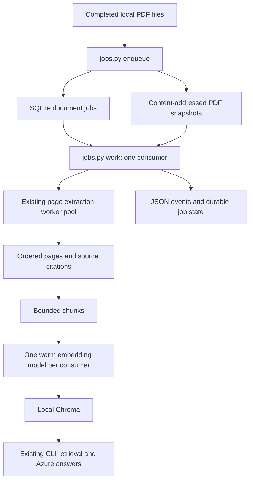

# Local RAG MVP: architecture and operations

## Scope and readiness

This milestone is a single-host, trusted-operator ingestion application with a
CLI chat client. It is not a public API, a multi-tenant service, or an Azure deployment.
No cloud resources are provisioned. The working code is reused, not replaced by
a new framework. The native PDF/model/vector baseline is still blocked by missing
dependencies; passing contract tests is not a substitute for that gate.

## Ownership and flow



| File | Responsibility |
| --- | --- |
| `jobs.py` | Operator commands, watch loop, runtime preflight, job execution, warm model reuse |
| `src/pdf_pipeline/job_store.py` | SQLite transitions, snapshots, deduplication, OS consumer lock |
| `src/pdf_pipeline/watcher.py` | Recursive PDF discovery, stability detection, changed-file submission |
| `src/pdf_pipeline/main.py` | Page processes, bounded wait, result validation and cleanup |
| `src/pdf_pipeline/checkpoints.py` | Versioned range result storage, checksums, atomic save and validation |
| `ingest_sources.py` | Source metadata, chunks, embedding batches and Chroma writes |
| `rag_core.py` | Retrieval bounds, evidence context and Azure answers |
| `baseline.py` | Isolated five-PDF/300-page live validation and timing reports |

## Data and state

Default state lives in `data/jobs/` (Git-ignored): `jobs.sqlite3`, `snapshots/`,
`checkpoints/`, and `consumer.lock`. Keep it on a local disk, not a network share. PDFs are read
in bounded blocks, limited to 100 MiB by default, checked for a PDF header, hashed,
and snapshotted before enqueue commits. A header is not a malware scan or proof
the PDF is parseable; native extraction performs the later parsing.

Each job records an ID, original absolute source path, SHA256 hash, snapshot path,
state, attempts, retry limit, timestamps, sanitized error type and indexed chunk
count. Status/log commands omit source paths and document text. The local SQLite
database itself contains paths and needs filesystem access protection.

```text
enqueue -> queued -> running -> ready
                      |
                      +-> queued with backoff -> running
                      |
                      +-> failed after retry limit

process interruption -> next locked consumer recovers running jobs
failed -> explicit retry, only when no newer source revision exists
```

- Same latest source/hash returns the existing job, including if failed. Use
  `retry` for a failed job after fixing its cause. A newer source hash creates a
  new job. Reverting from A to B to A creates a fresh A job, not a false duplicate.
- Pending revisions of one source execute in order. A delayed retry blocks newer
  revisions of that source but not unrelated documents.
- The consumer holds an OS lock for its entire invocation. Process death releases
  it; the next consumer recovers interrupted jobs. Recovery retains attempt counts.
- Default retry limit is three attempts; backoff starts at 5 seconds and is capped
  at 300 seconds. `watch` revisits due retries automatically. `work` remains a
  one-shot command: invoke it again later for delayed retries.
- The job store binds to one absolute index path and collection. It refuses a
  later target change. Do not point another job store or legacy writer at that index.
- Processing is at-least-once, not exactly-once. A crash after indexing but before
  marking ready replays indexing; content-based upsert IDs make replays converge.
  Completed extraction ranges are reused from validated checkpoints on retry.
- SHA256 is checked before processing the snapshot. Existing source changes do not
  alter that job's input. Submit files only after their writer has finished.
- After `ready` commits, the consumer removes generated snapshots and new grouped
  checkpoints only if no queued/running/failed job shares the content hash. Original
  PDFs and Chroma are never deleted here. Cleanup failure logs `cleanup_deferred`
  and cannot requeue the already-indexed job. Metadata remains for deduplication.

## Operator commands

Run from the repository root after installing `requirements.txt` in `.venv`:

```powershell
# Automatic mode: start once, then drop PDFs into data/input or its subfolders.
.\.venv\Scripts\python.exe jobs.py watch data/input --workers 2 --pages-per-task 10
```

Watch mode retains one consumer lock and one processor/model for its lifetime.
By default it scans every 2 seconds, requires 10 seconds of unchanged file
size/timestamps, and processes one due document between scans. Use `--limit`
to change documents per scan, `--poll-seconds` to change the scan interval, and
`--stable-seconds` to change the quiet period. A long-running document delays the
next scan; this is polling, not a separate parallel upload service.

Use a `.partial` extension while copying, then rename to `.pdf` on completion.
A quiet period cannot prove that a paused writer is finished. Files changed
during snapshot creation are rejected for that observed version and reconsidered
after a detected change. Locked files are retried on later scans. Invalid PDF
versions are reported once per scanner lifetime; changed versions are reconsidered.

On startup the watcher also discovers files already present. SQLite deduplicates
unchanged submissions across restarts. The in-memory signature cache avoids
rehashing unchanged files during the same run; edits that preserve all observed
filesystem metadata are not guaranteed to be detected until a restart.

State and index directories must be outside the watched folder. File symlinks
are skipped. This remains a trusted local-folder feature, not a hardened upload
endpoint. Removing a PDF does not delete prior jobs or its indexed content.

The terminal prints `watch_started`, `watch_submitted`, `watch_progress`, and
job-result events. Ctrl+C prints `watch_stopped` and releases the consumer lock;
an interrupted document can be recovered at next startup. Once maximum attempts
are exhausted, use explicit `retry` after correcting the problem. Watch mode
does not automatically retry terminal failures forever.

There is no background Windows service or automatic logon task installed. Keep
the process running; after reboot, start it again. Missing runtime dependencies
fail preflight before scanning or claiming any jobs. This command indexes PDFs;
it does not automatically ask questions or invoke Azure answer generation.

Manual commands remain useful for inspecting or controlling jobs:

```powershell
# Snapshot a batch, or provide a single PDF path instead.
.\.venv\Scripts\python.exe jobs.py enqueue data/input --max-mb 100 --max-attempts 3

# Process up to 100 due documents, two page processes per document.
.\.venv\Scripts\python.exe jobs.py work --workers 2 --limit 100

# Show counts plus the latest 50 jobs.
.\.venv\Scripts\python.exe jobs.py status --limit 50

# Retry a failed latest revision after correcting its cause.
.\.venv\Scripts\python.exe jobs.py retry JOB_ID

# Query the completed local index.
.\.venv\Scripts\python.exe chat_rag.py
```

`--state-dir` is a global option, placed before the subcommand. For a separate
experiment, use both a separate state directory and separate `work --database`.
Exit code 2 means blocked prerequisites, invalid input, or observed job failures.
A zero exit from `work` does not mean the queue is empty: inspect `states` for
pending/delayed jobs. Re-enqueueing an existing job does not imply it is ready.

## Monitoring and troubleshooting

- `status` shows state counts, attempts, next retry time and last error class.
  Timestamps are Unix UTC seconds. Repeated `running` after a killed process is
  expected until the next consumer performs recovery.
- Each attempt emits `job_ready` or `job_attempt_failed`, job ID, attempt number
  and duration. Detailed lower-level library logs may still include paths; keep
  terminal logs private. Exception messages are not placed in durable error fields.
- `blocked` with missing packages means no job was claimed or attempt consumed.
- `failed` jobs require inspection; don't endlessly retry corrupt PDFs or exhausted
  disk. Successful unreferenced retry artifacts are retired automatically; failed
  jobs, legacy checkpoints and queue history still need operator retention. Backups
  are not automated. Normal RAG ingestion no longer writes redundant text exports.
- Back up the stopped job store, snapshots and index together. Do not copy only the
  SQLite file during writes, or restore an old queue against a newer index.

## Verification and release gates

Tests cover duplicate submissions, immutable snapshots, source-version ordering,
retry/backoff, target binding, exclusive consumers, sanitized failures, and warm
model reuse. A real child-process termination test verifies persisted `running`
state, OS lock release, and replay by the next consumer. PDF extraction in these
queue tests is simulated; fake `%PDF` inputs only test submission validation.

```powershell
.\.venv\Scripts\python.exe -m pytest -q -rs
.\.venv\Scripts\python.exe baseline.py --workers 2
# Optional synthetic Azure requests; API charges may apply.
.\.venv\Scripts\python.exe baseline.py --workers 2 --azure
```

The range implementation has local tests for exact coverage, one open per range
(fake native library), incomplete/corrupt result rejection, and real worker-process
exit followed by resume. A native 23-page extraction/cache-reuse test is included
but skips when PyMuPDF is missing. The five-PDF baseline now uses range tasks.
Neither constitutes a measured production speedup until native tests run.

Before production, all of these gates remain necessary:

1. Install native dependencies; pass the live 300-page baseline and five real
   50+ page PDFs with known-answer/citation checks. Pin the versions that pass.
2. Benchmark the implemented checkpointed ranges, add streaming aggregation, and
  test large files, OCR needs, disk exhaustion, corrupt PDFs and bounded memory.
3. Add atomic document-version publication in a shared index. Current multi-batch
   Chroma updates can expose partial revisions. `ready` is job success, not a
   transactional visibility boundary. Pause chat during writes if consistency matters.
4. Add authenticated upload/chat APIs, per-user document authorization enforced
   during retrieval, upload quotas, streaming, conversation handling and rate limits.
5. Move snapshots to Blob Storage, dispatch through Service Bus, and replace the
   OS lock with distributed ownership/leases plus fencing before enabling replicas.
   Event-driven uploads and periodic reconciliation are not implemented here.
6. Add metrics/traces, alerts on oldest queued age and repeated failures, retention,
   tested backup/restore, migration/rollback procedures and deployment configuration.
7. Benchmark burst ingestion and simultaneous conversations; establish latency,
   throughput, answer-quality and cost targets from measurements, not estimates.

The consumer reuses one embedding model per invocation. It still processes one
document at a time and keeps that document's records/chunks in memory. Watch mode
automates discovery and retries but does not automatically scale. Native PDF waits are
bounded, but embedding-model load and index operations do not yet have enforced
process-level deadlines. Do not expose this trusted local MVP as a public service.