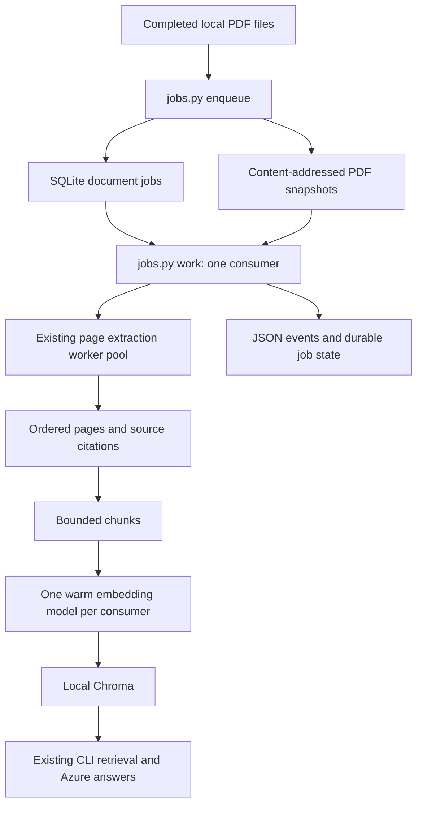

# Local RAG MVP: architecture and operations

## Scope and readiness

This milestone is a single-host, trusted-operator ingestion application with a
CLI chat client. It is not a public API, a multi-tenant service, or an Azure deployment.
No cloud resources are provisioned. The working code is reused, not replaced by
a new framework. The native PDF/model/vector baseline is still blocked by missing
dependencies; passing contract tests is not a substitute for that gate.

## Ownership and flow

PDF extraction now shares one PyMuPDF/Tesseract quality policy across local and
Azure range jobs, with optional OCR and native/OCR/blank provenance. See the
[extraction-quality guide](CODE_WALKTHROUGH.md#extraction-quality-and-ocr) for
language-data requirements, fail-closed behavior, policy-version migration, and
the real-document accuracy acceptance gate. No 99.9% accuracy claim is made.



| File | Responsibility |
| --- | --- |
| `jobs.py` | Local adapter commands, watch loop, runtime preflight and durable completion |
| `src/pdf_pipeline/job_store.py` | SQLite transitions, snapshots, deduplication, OS consumer lock |
| `src/pdf_pipeline/watcher.py` | Recursive PDF discovery, stability detection, changed-file submission |
| `src/pdf_pipeline/main.py` | Page processes, bounded wait, result validation and cleanup |
| `src/pdf_pipeline/checkpoints.py` | Versioned range result storage, checksums, atomic save and validation |
| `ingest_sources.py` | Shared `DocumentPublisher`, model reuse, source metadata, chunks, embedding batches and Chroma publication |
| `rag_core.py` | Retrieval bounds, evidence context and Azure answers |
| `baseline.py` | Isolated five-PDF/300-page live validation and timing reports |

## Data and state

Default state lives in `data/jobs/` (Git-ignored): `jobs.sqlite3`, `snapshots/`,
`checkpoints/`, and `consumer.lock`. Keep it on a local disk, not a network share. PDFs are read
in bounded blocks, limited to 100 MiB by default, checked for a PDF header, hashed,
and snapshotted before enqueue commits. A header is not a malware scan or proof
the PDF is parseable; native extraction performs the later parsing.

Each job records an ID, original absolute source path, SHA256 hash, snapshot path,
state, attempts, retry limit, timestamps, sanitized error type and indexed chunk
count. Status/log commands omit source paths and document text. The local SQLite
database itself contains paths and needs filesystem access protection.

```text
enqueue -> queued -> running -> ready
                      |
                      +-> queued with backoff -> running
                      |
                      +-> failed after retry limit

process interruption -> next locked consumer recovers running jobs
failed -> explicit retry, only when no newer source revision exists
```

- Same latest source/hash returns the existing job, including if failed. Use
  `retry` for a failed job after fixing its cause. A newer source hash creates a
  new job. Reverting from A to B to A creates a fresh A job, not a false duplicate.
- Pending revisions of one source execute in order. A delayed retry blocks newer
  revisions of that source but not unrelated documents.
- The consumer holds an OS lock for its entire invocation. Process death releases
  it; the next consumer recovers interrupted jobs. Recovery retains attempt counts.
- Default retry limit is three attempts; backoff starts at 5 seconds and is capped
  at 300 seconds. `watch` revisits due retries automatically. `work` remains a
  one-shot command: invoke it again later for delayed retries.
- The job store binds to one absolute index path and collection. It refuses a
  later target change. Do not point another job store or legacy writer at that index.
- Processing is at-least-once, not exactly-once. A crash after indexing but before
  marking ready replays input processing. The shared publisher returns the committed
  receipt for the same generation instead of embedding/writing another revision.
  This now applies to both local and Azure production paths. Input extraction or
  tokenization may still repeat; cross-backend source IDs and retry scheduling
  remain distinct. Old physical revisions from real updates or legacy attempts
  remain until explicit lease-aware cleanup is applied.
  Completed extraction ranges are reused from validated checkpoints on retry.
- SHA256 is checked before processing the snapshot. Existing source changes do not
  alter that job's input. Submit files only after their writer has finished.
- After `ready` commits, the consumer removes generated snapshots and new grouped
  checkpoints only if no queued/running/failed job shares the content hash. Original
  PDFs and Chroma are never deleted here. Cleanup failure logs `cleanup_deferred`
  and cannot requeue the already-indexed job. Metadata remains for deduplication.

## Operator commands

Run from the repository root after installing `requirements.txt` in `.venv`:

```powershell
# Automatic mode: start once, then drop PDFs into data/input or its subfolders.
.\.venv\Scripts\python.exe jobs.py watch data/input --workers 2 --pages-per-task 10
```

Watch mode retains one consumer lock and one processor/model for its lifetime.
By default it scans every 2 seconds, requires 10 seconds of unchanged file
size/timestamps, and processes one due document between scans. Use `--limit`
to change documents per scan, `--poll-seconds` to change the scan interval, and
`--stable-seconds` to change the quiet period. A long-running document delays the
next scan; this is polling, not a separate parallel upload service.

Use a `.partial` extension while copying, then rename to `.pdf` on completion.
A quiet period cannot prove that a paused writer is finished. Files changed
during snapshot creation are rejected for that observed version and reconsidered
after a detected change. Locked files are retried on later scans. Invalid PDF
versions are reported once per scanner lifetime; changed versions are reconsidered.

On startup the watcher also discovers files already present. SQLite deduplicates
unchanged submissions across restarts. The in-memory signature cache avoids
rehashing unchanged files during the same run; edits that preserve all observed
filesystem metadata are not guaranteed to be detected until a restart.

State and index directories must be outside the watched folder. File symlinks
are skipped. This remains a trusted local-folder feature, not a hardened upload
endpoint. Removing a PDF does not delete prior jobs or its indexed content.

The terminal prints `watch_started`, `watch_submitted`, `watch_progress`, and
job-result events. Ctrl+C prints `watch_stopped` and releases the consumer lock;
an interrupted document can be recovered at next startup. Once maximum attempts
are exhausted, use explicit `retry` after correcting the problem. Watch mode
does not automatically retry terminal failures forever.

There is no background Windows service or automatic logon task installed. Keep
the process running; after reboot, start it again. Missing runtime dependencies
fail preflight before scanning or claiming any jobs. This command indexes PDFs;
it does not automatically ask questions or invoke Azure answer generation.

Manual commands remain useful for inspecting or controlling jobs:

```powershell
# Snapshot a batch, or provide a single PDF path instead.
.\.venv\Scripts\python.exe jobs.py enqueue data/input --max-mb 100 --max-attempts 3

# Process up to 100 due documents, two page processes per document.
.\.venv\Scripts\python.exe jobs.py work --workers 2 --limit 100

# Show counts plus the latest 50 jobs.
.\.venv\Scripts\python.exe jobs.py status --limit 50

# Retry a failed latest revision after correcting its cause.
.\.venv\Scripts\python.exe jobs.py retry JOB_ID

# Query the completed local index.
.\.venv\Scripts\python.exe chat_rag.py
```

`--state-dir` is a global option, placed before the subcommand. For a separate
experiment, use both a separate state directory and separate `work --database`.
Exit code 2 means blocked prerequisites, invalid input, or observed job failures.
A zero exit from `work` does not mean the queue is empty: inspect `states` for
pending/delayed jobs. Re-enqueueing an existing job does not imply it is ready.

## Monitoring and troubleshooting

- `status` shows state counts, attempts, next retry time and last error class.
  Timestamps are Unix UTC seconds. Repeated `running` after a killed process is
  expected until the next consumer performs recovery.
- Each attempt emits `job_ready` or `job_attempt_failed`, job ID, attempt number
  and duration. Detailed lower-level library logs may still include paths; keep
  terminal logs private. Exception messages are not placed in durable error fields.
- `blocked` with missing packages means no job was claimed or attempt consumed.
- `failed` jobs require inspection; don't endlessly retry corrupt PDFs or exhausted
  disk. Successful unreferenced retry artifacts are retired automatically; failed
  jobs, legacy checkpoints and queue history still need operator retention. Backups
  are not automated. Normal RAG ingestion no longer writes redundant text exports.
- Back up the stopped job store, snapshots and index together. Do not copy only the
  SQLite file during writes, or restore an old queue against a newer index.

## Storage lifecycle plan

This section contains the cleanup plan and implementation progress as of 2026-09-15.
It does not enable Azure deletion, create retention policies, or claim live Azure tests.
The objective is to remove disposable extraction artifacts after successful index
publication while preserving original sources, searchable evidence, active readers,
and recoverable jobs. Repeating a passing check 200 times is not proof of safety;
the acceptance matrix below covers different failure boundaries instead.

### Stage A progress: local evidence implemented

- Local cleanup-warning output is isolated: a broken log stream cannot turn a
  ready document into a failed/requeued job.
- The coordinator now creates a unique processing generation for each newly
  observed ETag and each explicit retry. It preserves append-only transition
  snapshots in `cloud_history` while retaining the latest view for scheduling.
- Existing coordinator rows migrate without deletion. Imported ready rows are
  marked as lacking publication receipts; migration never invents proof of indexing.
- `build_index(..., publication_generation=...)` returns an immutable receipt for
  one source. It is committed in `publication_receipts` in the same transaction as
  the active index revision. Default count-only callers remain compatible.
- Receipts identify the database, collection identity, source, generation, prepared
  input hash, revision, publication schema and actual embedded chunk count.
- Replay with the same generation/input returns the committed receipt, without
  another vector write or republishing over a newer source revision. Reusing a
  generation for different prepared input fails. After restoring/replacing an
  index, receipt identity must match that index's publication store.
- Production coordinator finalization requires a receipt and verifies it against
  committed publication state before saving ready. The coordinator receipt update
  and its history event commit together. The crash gap after index commit is
  recovered by replaying the same generation. Current replay still needs the range
  results and loads/tokenizes input; it does not justify deleting them early.

```powershell
.\.venv\Scripts\python.exe azure_pipeline.py coordinate-status --history --retirement-preview
```

This bounded local preview verifies available receipts and lists blockers. It makes
no Azure calls and always reports `cloud_deletion_enabled=false` and no generation
eligible for deletion. Byte inventory is unknown (`null`), not zero. Detailed
history snapshots contain source names and receipt paths in the local SQLite file;
CLI history/preview omit these fields, document contents and credentials.

Processing generations here belong to coordinator/index publication only. Range
message IDs still use the existing content manifest version; they do not yet carry
a fenced retirement generation. Cloud-visible receipts, worker fencing, shared
source reference protection, conditional deletion and resumable cleanup remain
unimplemented. Never treat the local preview as deletion authorization.

Verification of this milestone: **151 non-live tests passed, 14 deselected**.
Coverage includes overwritten-version history, explicit-retry generations, legacy
migration, receipt rollback, replay without re-embedding, newer-version protection,
coordinator receipt persistence failure and local logging failure. Azure deletion
and real Chroma/cloud behavior remain unverified.

### 1. Original code audit (before Stage A changes)

| Boundary | Current owner | Verified by code inspection |
| --- | --- | --- |
| Local extraction -> indexing | [jobs.py](../jobs.py): `make_processor` | Snapshot integrity is checked; page records feed chunks/embeddings without normal full-text exports |
| Local successful cleanup | [job_store.py](../src/pdf_pipeline/job_store.py): `cleanup_ready_artifacts` | Requires ready state; checks same-hash unfinished jobs inside a write transaction; deletes generated snapshots/new grouped checkpoints, not originals |
| Azure source/range storage | [distributed.py](../src/pdf_pipeline/distributed.py) | Content-addressed source PDFs, version manifests and create-only range results are retained |
| Azure completion receipt | [orchestrator.py](../src/pdf_pipeline/orchestrator.py): `coordinator_cycle` | Index call succeeds before ready is saved; publication and receipt are separate commits |
| Azure version observation | `CoordinatorState.observe` | One row per blob name is replaced on new ETag; this is not a permanent history of every processed version |
| Worker acknowledgment | [azure_adapters.py](../src/pdf_pipeline/azure_adapters.py): `handle_message` | Completes the message after validating stored output; duplicate delivery relies on that output still existing |
| Old vectors | [index_publication.py](../index_publication.py): `cleanup_revisions` | Explicit preview/apply excludes active and reader-leased revisions; raw Chroma access is outside that protection |

### 2. Original gaps and remaining deletion blockers

Items 4, 5 and 8 below describe the pre-implementation audit; their local fixes
are listed above. The distributed retirement safeguards in items 1-3 and the
retention/recovery decisions in items 6-7 are still needed.

1. `reconcile()` interprets a missing range result as unfinished work and resends
   its task. Deletion without a durable retired state causes re-extraction.
2. `process_task()` can recreate a missing result. A worker may already hold PDF
   bytes and continue after a cleanup check. A pre-write marker check alone is
   vulnerable to a check-then-write race.
3. Source snapshots are shared by PDF hash across versions/documents. Deleting
   a source because one document finished may break another document's worker.
4. Coordinator rows retain only the latest observation per blob name. Overwrites
   erase the previous completion details needed for safe version-by-version cleanup.
5. The indexer returns a chunk count, not a durable publication receipt identifying
   the index instance, logical source and committed revision. A ready row alone
   cannot establish that a restored/replaced index still owns that publication.
6. Failed/cancelled/obsolete jobs need an explicit decision about retry rights.
   An age threshold alone must not silently discard their only recovery data.
7. Local cleanup is attempted immediately after success, not through a persistent
   cleanup queue. A crash before cleanup or `cleanup_deferred` can leave artifacts
   indefinitely. Old flat checkpoint ownership is not safely reconstructible.
8. In local `process_due`, printing `cleanup_deferred` still occurs inside the
   processing try block. If that print raises, execution can try to fail an already
   ready job. The cloud coordinator has output isolation; the local path needs the
   equivalent regression and repair before expanding unattended cleanup.

These are observed code paths and design gaps. Cloud data loss, billing savings,
or storage reclamation have not been demonstrated by a live run.

### 3. Retention decisions

| Artifact | Proposed rule |
| --- | --- |
| User original PDF / incoming Blob | Never deleted by intermediate-artifact cleanup; governed by a separate owner-approved source-retention policy |
| In-memory page records | Release after indexing; do not create permanent text/JSONL copies by default |
| Local snapshots/checkpoints | Retire after publication + ready receipt and no unfinished shared references; retry deferred cleanup independently |
| Azure range results | Retire only after authoritative publication receipt, closed processing generation, and worker-write fencing |
| Azure content-addressed source copy | Delete only after all referencing processing generations are retired and no worker can still need/write from it |
| Active index text/vectors/citations | Keep: answers need the original evidence, not just vectors |
| Old/abandoned index revisions | Continue separate reader-aware cleanup; do not mix vector retirement with PDF-intermediate retirement |
| Failed jobs and their artifacts | Keep until resolved or explicitly abandoned under an approved policy |
| Small receipts/tombstones | Retain while replay/reconciliation can refer to their generation; deleting them can permit resurrection |

Do not choose an arbitrary 24-hour or 7-day deletion period yet. First determine
queue TTL, dead-letter retention/replay rules, worker maximum lifetime, backup
retention, and operator retry requirements. Service Bus lock expiry is not proof
that the worker stopped running. Logical deletion may also retain billed data under
Blob soft-delete/versioning or Chroma's physical storage; report those separately.

### 4. Implementation order

**Stage A: authoritative lifecycle records, no cloud deletes.** Local history,
generation-linked receipts and no-delete preview are implemented as described
above. Shared cloud records and artifact inventory are still pending.

- Extend the existing coordinator with append-only processing-version history and
  an explicit generation/run ID. Keep the current latest-upload view for scheduling,
  but do not destroy the history when an ETag changes.
- Have atomic index publication return a receipt describing the target collection
  identity, source, revision, count and processing generation. Persist it before
  making intermediates eligible. Define recovery for the crash between commits.
- Preserve a small shared cloud completion/retirement record that manual dispatch,
  reconciliation, workers and collection all consult. A local ready row alone is
  not visible to independent worker machines.
- Make retirement transitions conditional on the expected generation/ETag. A new
  upload or explicit reprocess must not inherit the old generation's deletion plan.
- Add inventory/preview output: candidate bytes, blocked reasons, protected
  references, expected object ETags and affected versions. No deletion in this stage.

**Stage B: stop resurrection before deleting.**

- Introduce an enforceable generation-close protocol that coordinates workers,
  reconciliation and cleanup. Reject new claims for a closing generation.
- Prove result publication cannot race generation retirement. Options include
  serialized final publication through a coordinator/gateway or a tested shared
  locking protocol covering the actual write and retirement operations. Merely
  adding `if retired: return` before upload is insufficient.
- If using expiring leases, enforce loss of write permission/fencing at the storage
  publication boundary; a stale worker must not write with an expired lease.
- Late messages for a retired generation acknowledge its durable completion record
  rather than require deleted results. Explicit reprocessing opens a new generation.
- Track shared source references transactionally with new-reference creation and
  retirement. Checking a count and deleting outside that protection is unsafe.

**Stage C: bounded, resumable deletion.**

- Add conditional delete support to the existing Blob adapter, using expected
  object identity/ETag and narrowly derived artifact names. Never delete a whole
  container or a user-selected prefix blindly.
- Delete in bounded batches, record each completed step, and make retries harmless
  when an object is already absent. Stop on unexpected replacement or invalid state.
- Keep index success separate from cleanup status: `cleanup_pending`, `cleaning`,
  `cleaned`, or `cleanup_failed` must not requeue successful embedding/index work.
- Add a small background/scheduled reconciler for deferred local/cloud cleanup,
  not another duplicate ingestion pipeline. Scan only owned artifacts; unknown
  legacy data is preview-only until ownership is verified.
- Enable automatic cleanup only after the matrix below passes locally and on a
  dedicated Azure staging dataset, with rollback/rebuild instructions documented.

### 5. Proposed lifecycle

```text
observed -> dispatched -> extracting -> complete -> index published
         -> publication receipt persisted -> retirement requested
         -> generation closed and writes fenced -> artifacts deleted
         -> compact durable completion/tombstone retained
```

If embedding/indexing fails, remain recoverable and retain the intermediates.
If cleanup fails after publication, keep the document searchable and retry only
cleanup. If required evidence or ownership is unknown, retain the object and alert.
No timeout alone is permission to delete an original or a shared snapshot.

### 6. Cross-check and acceptance matrix

| Scenario | Required result | Coverage today |
| --- | --- | --- |
| All extraction finished, embedding fails | Keep intermediates; no cleanup-ready transition | Local failed-artifact and coordinator failure tests cover parts of this |
| Index succeeds; process dies before ready receipt | Recover publication ownership without unsafe retirement | Replay exists; exact publication receipt linkage still needed |
| Ready receipt exists; cleanup fails | Keep ready; schedule cleanup separately | Local cleanup-failure tests exist; durable cleanup scheduler missing |
| Cleanup event logging fails | Do not requeue indexed work | Cloud logging tested; local cleanup-warning boundary needs repair |
| Two documents share PDF bytes | First completion cannot delete second job's snapshot | Local shared-reference test exists; cloud reference registry missing |
| PDF overwritten after dispatch | Old artifacts retain their own version history | Latest-version protection exists; historical retirement records missing |
| Reconcile runs after deleting range results | Do not resend retired-generation work | Not implemented; currently resends missing results |
| Duplicate message after retirement | Acknowledge durable receipt without re-extraction | Before-retirement dedup tested; retired-generation behavior missing |
| Worker pauses before publishing, cleanup runs, worker resumes | No artifact resurrection and no stale completion | Fencing protocol and race test required |
| Queue lock expires but worker is still alive | Same protection as late worker | Broker lock renewal alone is insufficient |
| New reference is created while shared-source deletion starts | Either retain source or create a new valid generation safely | Requires coordinated reference/deletion protocol |
| Deletion succeeds; process dies before recording it | Retry recognizes absence and continues safely | New deletion adapter/state tests required |
| Blob changes after preview | Conditional deletion refuses replacement | Delete-by-ETag integration test required |
| Old revision is used by a reader | Preserve it until reader release | Local lease-aware cleanup tests exist |
| Reader crashes | Retain uncertain lease rather than expire unsafely | Real local process-death test exists |
| Cleanup scans unknown/legacy data | Report and retain, not broad delete | Local legacy-vector preservation exists; cloud inventory required |
| Index/queue restored from mismatched backups | Refuse retirement until reconciled | Collection identity guard exists; cross-system recovery gate required |
| Input PDF is removed by the user | Do not assume indexed data or shared snapshots can all be removed | Removal policy remains separate |

Expand these into deterministic concurrency tests and fault injection at each
durable boundary. Run stress tests with recorded seeds/interleavings only after
basic invariants pass. Repeating the same happy path 200 times is not a replacement
for a missing race test. Record exact counts/results; do not invent a check count.

Cross-check performed for this plan on 2026-09-15: **18 selected existing tests
passed, 57 deselected** across job cleanup, failed-artifact retention, coordinator
receipts, reconciliation, lost acknowledgment and reader protection. These used
isolated test fixtures, not user PDFs or live Azure. Proposed retirement/fencing
cases remain unimplemented and must not be counted as passed.

### 7. Monitoring and completion criteria

Track artifact bytes by original/snapshot/checkpoint/range-result/index category;
eligible, protected and orphaned bytes; deferred cleanup count and age; deletion
failures; replay suppression; late-worker rejections; and index publication failures.
Separate bytes logically deleted from bytes actually reclaimed/billed. Do not log
PDF text, keys, SAS tokens or connection strings in cleanup events.

Done means: the failure matrix has evidence; originals and active evidence survive;
retired work cannot be resurrected; retryable work still resumes; garbage collection
does not re-index documents; and staging measurements show controlled storage
growth under repeated uploads. Until then, Azure deletion remains disabled.

## Verification and release gates

Tests cover duplicate submissions, immutable snapshots, source-version ordering,
retry/backoff, target binding, exclusive consumers, sanitized failures, and warm
model reuse. A real child-process termination test verifies persisted `running`
state, OS lock release, and replay by the next consumer. PDF extraction in these
queue tests is simulated; fake `%PDF` inputs only test submission validation.

```powershell
.\.venv\Scripts\python.exe -m pytest -q -rs
.\.venv\Scripts\python.exe baseline.py --workers 2
# Optional synthetic Azure requests; API charges may apply.
.\.venv\Scripts\python.exe baseline.py --workers 2 --azure
```

The range implementation has local tests for exact coverage, one open per range
(fake native library), incomplete/corrupt result rejection, and real worker-process
exit followed by resume. A native 23-page extraction/cache-reuse test is included
but skips when PyMuPDF is missing. The five-PDF baseline now uses range tasks.
Neither constitutes a measured production speedup until native tests run.

Before production, all of these gates remain necessary:

1. Install native dependencies; pass the live 300-page baseline and five real
   50+ page PDFs with known-answer/citation checks. Pin the versions that pass.
2. Benchmark the implemented checkpointed ranges, add streaming aggregation, and
  test large files, OCR needs, disk exhaustion, corrupt PDFs and bounded memory.
3. Verify the implemented local publication pointers and reader-lease cleanup
  against real Chroma. Application readers now filter one immutable published
  snapshot per question; raw Chroma readers do not. A shared cloud index still
  needs its own distributed publication/ownership design. Stop chat for resets.
4. Add authenticated upload/chat APIs, per-user document authorization enforced
   during retrieval, upload quotas, streaming, conversation handling and rate limits.
5. Move snapshots to Blob Storage, dispatch through Service Bus, and replace the
   OS lock with distributed ownership/leases plus fencing before enabling replicas.
  The optional `azure_pipeline.py coordinate` command now polls Blob uploads and
  periodically reconciles/finalizes them with local durable receipts. It is one
  coordinator host, not a distributed lease/fencing service or Event Grid handler.
6. Add metrics/traces, alerts on oldest queued age and repeated failures, retention,
   tested backup/restore, migration/rollback procedures and deployment configuration.
7. Benchmark burst ingestion and simultaneous conversations; establish latency,
   throughput, answer-quality and cost targets from measurements, not estimates.

The consumer reuses one embedding model per invocation. It still processes one
document at a time and keeps that document's records/chunks in memory. Watch mode
automates discovery and retries but does not automatically scale. Native PDF waits are
bounded, but embedding-model load and index operations do not yet have enforced
process-level deadlines. Do not expose this trusted local MVP as a public service.